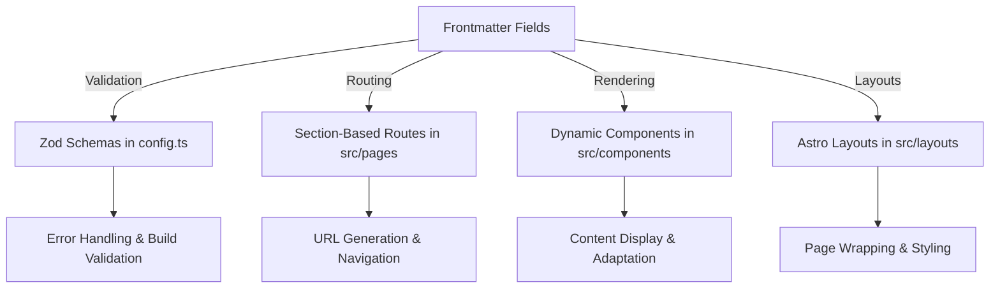
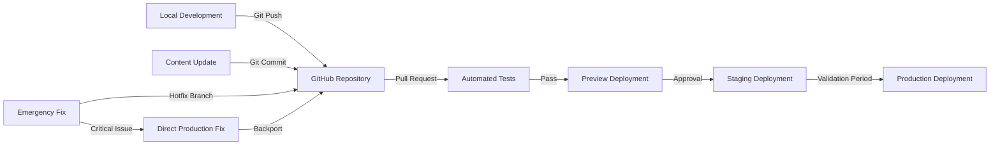

# Liminal Knowledge Engine — Consolidated System Overview

This document serves as a high-level synthesis of the entire system architecture, design philosophy, and implementation logic powering this digital garden. It unifies key insights and technical patterns from all modular READMEs into a single guide for contributors, agents, and future maintainers.
****
---

## ⊞ Architecture Overview

The project is built as a **flat-file, scale-aware knowledge engine**, using Astro, Markdown/MDX, and semantic frontmatter to drive dynamic rendering and recursive synthesis.

### The Epistemic Engine (High-Level)

This site is more than a static collection of notes—it’s built as an epistemic engine. Notes evolve from `nano` to `mega` scale; metadata like `confidence` and `relationships` shape how fragments grow into structured insights. For a full explanation, see [Epistemic Engine README](README^EpistemicEngine.md).

### Folder Structure (Simplified)

```
src/
├── content/
│   └── bits/               # All content lives here; frontmatter-driven
├── pages/                  # Section routes: /library, /liminology, etc.
├── components/             # Reusable UI blocks (cards, glyphs, tag renderers)
├── layouts/                # Wrappers for rendering content by scale or section
├── styles/                 # Design tokens and base styling
└── about/                  # All internal documentation (this file lives here)
```

---

## ⊡ Media Frontmatter (Detailed)

Media notes (section: "library") follow a specialized YAML frontmatter schema:

- **Core Fields**: `title`, `slug`, `description`, `type`, `creator`, `pubDate`, `section`, `scale`, `tags`, `related`, `license`.
- **Supported Media Types**: `book`, `movie`, `music`, `artwork`, `tv_show`, `live_event`, `poem`, `photo`, `social_media`.
- **Portability**: Self-contained notes designed for easy sharing and reuse.
- **Consistency**: Standardized schema across media ensures predictable querying and rendering.

Example YAML for a movie:

```yaml
title: "Inception"
slug: "inception"
description: "A mind-bending thriller about dreams within dreams."
type: "movie"
creator: "Christopher Nolan"
pubDate: 2010-07-16
section: "library"
scale: "nano"
tags:
  - "sci-fi"
  - "thriller"
related:
  - "https://example.com/dream-theory"
license: "CC-BY-SA"
status: "live"
```

## ℭ Core Concepts

### Semantic Frontmatter

Every `.md` file contains schema-defined fields:

- `title`, `slug`, `description`
- `section`: `library`, `liminology`, `links`, `about`
- `scale`: `nano`, `micro`, `meso`, `macro`, `mega`
- `type`: `music`, `film`, `theory`, `social`, etc.
- `tags`, `confidence`, `maturity`, `sourceURL`, `relationships`
- `confidence`: `"low"` | `"moderate"` | `"high"` — estimates reliability and stability of the note

These fields control routing, rendering, filtering, and synthesis.

---

### Content Scales

Notes evolve across a **semantic scale spectrum**:

| Scale   | Description                     | Example                         |
| ------- | ------------------------------- | ------------------------------- |
| `nano`  | Minimal, atomic fragments       | Lyrics, quotes, memes, links    |
| `micro` | Small structured units          | Song, photo, short commentary   |
| `meso`  | Comparative or connective posts | Collabs, genre traits, patterns |
| `macro` | Thematic explorations           | Essays, frameworks, analyses    |
| `mega`  | Recursive synthesis artifacts   | Manifestos, strategic models    |

Scale affects layout, prominence, confidence, and linkage.

---

### Section Definitions

| Section      | Role                                                  |
| ------------ | ----------------------------------------------------- |
| `library`    | Media analysis — across scale, type, and aesthetic    |
| `liminology` | Theoretical structures, notation, and epistemic tools |
| `links`      | Inbound/outbound fragments, portals, signals          |
| `about`      | Site structure, documentation, epistemic declarations |

---

## ⇌ Data & Component Flow

1. **Write**: Content is created in `/src/content/bits/`, tagged semantically
2. **Validate**: Schema checked via `config.ts` using `zod` and `defineCollection`
3. **Query**: Pages use `getCollection('bits', filterFn)` to pull specific subsets
4. **Render**: Layouts and components adapt to `scale`, `section`, and `type`
5. **Link**: All notes can connect via `relationships` or in-body glyphs

### 📈 Suggested Visuals

We recommend maintaining or generating visuals that align with key system flows:

- **Content Lifecycle Diagram:** From nano note creation to mega synthesis
- **Component Rendering Flow:** How frontmatter keys like `layout` and `component` shape display
- **Glyph Interaction Web:** Examples of how symbolic notation interlinks nodes semantically

These can be embedded in `/src/about/` or linked via local media fields in relevant notes.

## ∴ Strategic Layer: Epistemic Engine

This site isn’t just a CMS — it’s an **engine for generating understanding**.

- `scale`, `confidence`, and `relationships` encode knowledge resolution
- `nano` notes feed upward into `mega` syntheses
- Glyphs track cause, emergence, conflict, loops, and shifts
- New notes become recursive inputs → the system learns

### Engine Mechanics & Application

- **Scale + Confidence + Maturity**: Each note evolves across scale (`nano` → `mega`) while being rated for stability (`confidence`) and update frequency (`tendDate`).
- **Recursive Synthesis**: Small fragments are promoted into comparative posts, which feed macro and mega syntheses.
- **Confidence as a Trigger**: A low `confidence` score paired with an old `tendDate` flags a note for review or revision.
- **Example Flow**: A `nano` quote tagged "hauntology" may be linked into a `meso` analysis on ghosts in media, which in turn is referenced in a `mega` piece on cultural memory systems.

### Intelligent Accretion

- The engine uses metadata, structure, and glyphs to form an ever-evolving epistemic map.
- Tags act as soft classifiers; relationships and sections establish hard structure.
- Updates propagate through `relationships` to maintain system coherence.

---

### Query Example

```js
const theoryNotes = await getCollection(
  "bits",
  ({ data }) => data.section === "liminology" && data.scale === "macro"
);
```

This query pulls all macro-scale theory notes from the 'liminology' section for rendering or analysis.

---

## ∿ Symbolic Layer: Liminal Notation System

This project uses a **custom symbolic grammar** to model relationships across concepts, systems, and media. Examples:

| Symbol | Meaning                       | Example                        |
| ------ | ----------------------------- | ------------------------------ |
| `→`    | Direct causation              | Censorship → Self-regulation   |
| `⊂`    | Is part of                    | Subcultures ⊂ Internet Culture |
| `↺`    | Self-reinforcing loop         | Algorithmic feed ↺ Engagement  |
| `∿`    | Complex/unstable relationship | Utopia ∿ Collapse              |
| `⊕`    | Synthesis                     | Art ⊕ Activism                 |

More in [Liminal Notation System](README^LiminalNotation.md)

### Full Glyph Table

**Tier 1 — Intuitive Symbols**

| Symbol | Meaning                        | Example                 |
| ------ | ------------------------------ | ----------------------- |
| →      | Leads to / causes / influences | Propaganda → Belief     |
| —      | Blocks / inhibits              | Censorship — Expression |
| ↔     | Mutual relationship            | Reader ↔ Author        |
| =      | Balance / equivalence          | Input = Output          |
| ↺      | Feedback / recursive cycle     | Algorithm ↺ Engagement  |
| ⟶      | Temporal transformation        | Data ⟶ Knowledge        |
| ⊂      | Containment                    | Meme ⊂ Culture          |
| ↑      | Emergence                      | Interactions ↑ Meaning  |

**Tier 2 — Analyst-Level Symbols**

| Symbol | Meaning                     | Example                        |
| ------ | --------------------------- | ------------------------------ |
| ⇒      | Strong causation            | Surveillance ⇒ Behavior Change |
| ↝      | Subtle influence            | Aesthetic ↝ Mood               |
| ±      | Mixed/dual effect           | Tech ± Liberation              |
| ¬      | Logical negation            | Policy → ¬Freedom              |
| ⊥      | No relation / orthogonality | Noise ⊥ Signal                 |
| ⇄      | Bidirectional exchange      | Market ⇄ Demand                |
| ⇌      | Equilibrium                 | Narrative ⇌ Counter-narrative  |
| ≡      | Identical                   | Sign ≡ Meaning                 |
| ≃      | Approximate equivalence     | Fantasy ≃ Dream                |
| ⟳      | Reinforcing loop            | Influence ⟳ Popularity         |
| ⟲      | Balancing loop              | Governance ⟲ Dissent           |
| Δ      | Change / shift              | Opinion Δ                      |
| ≺      | Precedence                  | Fear ≺ Reaction                |
| ∈      | Member of                   | Rebel ∈ Movement               |
| ⊆      | Subset                      | Essays ⊆ Writing               |
| ⊃      | Superset                    | Web ⊃ Blogs                    |
| ∴      | Emergent conclusion         | Inputs ∴ Insight               |
| Σ      | Summation                   | Σ (Threads) = Narrative        |
| ⇑      | Escalating emergence        | Virality ⇑ Chaos               |

View the [Liminal Notation Table →](README^LiminalNotation.md#tier-1-simplified-intuitive)

---

## ∴ Strategic Layer: Epistemic Engine

This site isn’t just a CMS — it’s an **engine for generating understanding**.

- `scale`, `confidence`, and `relationships` encode knowledge resolution
- `nano` notes feed upward into `mega` syntheses
- Glyphs track cause, emergence, conflict, loops, and shifts
- New notes become recursive inputs → the system learns

---

## ⟳ Content Lifecycle

Each note exists on a spectrum of epistemic clarity and scale. Content is not static — it evolves through writing, revisiting, linking, and reframing.

- `nano`: Instant capture — quotes, lyrics, fragments, signals
- `micro`: Quick insights, screenshots, reactions, flash commentary
- `meso`: Comparative structures, connections, extended thoughts
- `macro`: Syntheses, models, theories, reframings
- `mega`: Recursive essays, maps, strategic overviews

You can update incrementally or log major revisions in batch. Notes grow over time, not all at once.

---

## ⊡ Media Patterns (Library Section)

Media content uses `section: library` and supports typed objects like:

| Type    | Scale Hint | Examples                      |
| ------- | ---------- | ----------------------------- |
| `photo` | nano       | Screenshot, still image       |
| `tweet` | nano/micro | Commentary or linkout         |
| `song`  | micro      | Review or genre comparison    |
| `film`  | meso       | Analysis or scene dissection  |
| `book`  | macro      | Thematic breakdown, synthesis |

Use `type`, `tags`, and `confidence` to control rendering and navigation. Media notes are especially good for applying liminal notation (`⊂`, `↺`, `⊕`) to storytelling, aesthetic movement, or influence tracing.

---

## ≡ Frontmatter Reference

Every note begins with a YAML block that encodes semantic metadata. Here are core fields:

- `description`, `pubDate`, `tendDate`, `priority`, `sources`, `layout`, `component`, `assets`, `visibility`

```yaml
title: "Post-Truth Vibes"
slug: "post-truth-vibes"
description: "Brief summary of the note"
pubDate: 2025-03-01
tendDate: 2025-03-05
section: "liminology"
scale: "meso"
type: "theory"
tags:
  - "truth"
  - "disinfo"
  - "memetics"
status: "live"
confidence: "moderate"
priority: "medium"
sources:
  - type: "book"
    author: "Author Name"
    title: "Source Title"
    link: "https://example.com/source"
relationships:
  parent: "[[Truth Systems]]" # internal wiki-style link
  related:
    - "[[Media Fractures]]"
    - "[[Memetic Drift]]"
layout: "DefaultLayout"
component: "ArticleComponent"
assets:
  images:
    - "images/example.jpg"
  code:
    - "scripts/logic.js"
visibility:
  hide:
    - "pubDate"
    - "relationships"
license: "CC-BY"
sourceURL: "https://example.com/post-truth-essay"
```

These fields drive routing, visibility, filtering, linking, and design treatments. Some are optional (`license`, `sourceURL`), but fields like `title`, `slug`, `scale`, and `section` are critical.
See `src/content/bits/post-truth-vibes.md` for a working example of this frontmatter in use.

For real-world mappings of frontmatter fields to system logic, see:

### Real-World Mappings of Frontmatter Fields to System Logic

Here’s how the system processes the frontmatter metadata at the top of each note to function seamlessly:

- **Validation (Ensuring Accuracy):**  
   The system checks that the frontmatter adheres to predefined rules and schemas. This validation is handled in [`src/content/config.ts`](../../src/content/config.ts) using tools like `zod`. Think of it as proofreading your input to ensure it’s correct and complete.

- **Routing (Determining Placement):**  
   The `section` and `slug` fields guide the system in placing the note in the correct location. For instance, a note with `section: library` will appear under the `/library` route. This logic is implemented in [`src/pages`](../../src/pages).

- **Rendering (Defining Presentation):**  
   The system uses components to render notes based on their type and metadata. For example, a movie note might use a specific component to display its details. These components are located in [`src/components`](../../src/components).

- **Layouts (Structuring the Page):**  
   The `layout` field specifies the overall structure or wrapper for the note. For example, selecting `DefaultLayout` applies a standard layout from [`src/layouts`](../../src/layouts). This ensures consistency in how notes are presented.

This process transforms raw metadata into a polished, functional website.

### Visual Diagram: Frontmatter Flow

Below is a visual representation of how frontmatter fields interact with the system:



This diagram illustrates the seamless flow from frontmatter definition to system functionality, ensuring consistency and adaptability across the platform.

---

## ☰ Roles & Views

This system supports multiple audiences with different entry points and responsibilities:

- **Contributors**: Write and update content using semantic frontmatter and linked notes.
- **Developers**: Maintain components, layouts, and validation logic. Keep schema in sync with usage.
- **Editors**: Review note maturity, confidence, and `tendDate`. Help maintain epistemic quality and structure.
- **Readers**: Navigate by section or scale. Use tags and glyphs to explore relationships between concepts.

---

## ✅ Testing & Validation

The build system ensures content and components are robust through layered testing:

- **Unit Tests:** Validate functions and logic with Jest.
- **Integration Tests:** Ensure components render expected combinations of content.
- **End-to-End (E2E):** Use Cypress to simulate user flows.
- **Schema Validation:** Zod validates YAML frontmatter at build time.

All tests reside in `/tests/` or alongside components as `[Component].test.tsx`.

---

## ⊗ Integration & Accessibility

### Integration Principles

- Layouts and components are plug-and-play, connected through frontmatter and Astro’s content API.
- Schemas are defined in `src/content/config.ts` and shared across the system.

### Accessibility Guidelines

- Use semantic HTML elements and ARIA roles where appropriate.
- Maintain WCAG contrast ratios for readability.
- All components should support keyboard navigation and screen readers.

### Deployment Notes

The project is version-controlled with Git (via GitHub) and deployed through Netlify.  
Notes are authored and edited locally using Obsidian and VS Code.

---

##  Deployment Workflow

The Liminal Knowledge Engine follows a structured deployment pipeline that maintains system integrity while enabling continuous improvement.

### Build Commands & Environment Configuration

The project uses Astro's optimized build system with additional customizations:

```bash
# Development
npm run dev        # Local development server with hot reloading
npm run preview    # Preview production build locally

# Build & Validation
npm run validate   # Run frontmatter schema validation
npm run build      # Production build with optimizations
npm run test       # Run test suite before deployment

# Deployment
npm run deploy:staging    # Deploy to staging environment
npm run deploy:production # Deploy to production environment
```

#### Critical Environment Variables

These variables must be properly configured in Netlify's environment settings:

| Variable Name | Purpose | Example |
|---------------|---------|---------|
| `SITE_URL` | Base URL for canonical links | `https://liminal.knowledge` |
| `ANALYTICS_ID` | Plausible/analytics identifier | `liminal-knowledge` |
| `NODE_ENV` | Runtime environment | `production` or `staging` |
| `CONTENT_SECURITY_POLICY` | Security headers | `default-src 'self'...` |
| `API_KEYS` | External API integration (if used) | `{service}:{key}` |

The `.env.example` file provides templates for local development configuration.

### Deployment Pipeline

The system follows a phased deployment model with integrated validation:



#### Development → Staging → Production Flow

1. **Development Phase**:
   - Authors create/edit content locally using Obsidian or VS Code
   - Changes validated locally with `npm run validate`
   - Commits pushed to feature branches on GitHub

2. **Integration Phase**:
   - Pull requests trigger automated test runs
   - Netlify generates preview deployments for each PR
   - Content and code changes reviewed by maintainers
   - Approved PRs merged to `main` branch

3. **Staging Deployment**:
   - `main` branch automatically deploys to staging environment
   - URL pattern: `staging.liminal.knowledge`
   - Full content validation and visual regression tests run
   - Epistemic consistency checks performed

4. **Production Deployment**:
   - Scheduled deployments run weekly from staging to production
   - Manual promotion available for critical updates
   - Final validation checks run during deployment
   - Content made available at primary domain

### Staging vs. Production Environments

| Aspect | Staging | Production |
|--------|---------|------------|
| **Purpose** | Testing and validation | Public consumption |
| **Access** | Password-protected | Public |
| **Features** | Includes experimental components | Stable features only |
| **Analytics** | Debug mode enabled | Standard tracking |
| **Caching** | Minimal for testing | Aggressive for performance |
| **Deployment Frequency** | Multiple times daily | Weekly scheduled |
| **Validation Level** | Core functionality | Comprehensive |

### Content Propagation Strategy

Content changes follow a structured propagation path:

1. **Authoring**: Content created/updated in Markdown files
2. **Local Validation**: Frontmatter validated against schemas
3. **Commit & Push**: Changes committed with semantic commit messages
   - Format: `content(section): add/update/revise note-title`
   - Example: `content(library): add inception-movie-analysis`
4. **Integration**: Pull request creates preview deployment
5. **Staging**: Content appears on staging for final review
6. **Production**: Content published to main site during scheduled deployment

### Emergency Update Protocol

For critical fixes (broken links, factual errors, security issues):

1. Create a hotfix branch directly from `main`
2. Make minimal, focused changes to address the issue
3. Create a PR with the `urgent` label
4. Request expedited review from maintainers
5. Upon approval, changes deploy immediately to production
6. Document the emergency deployment in the change log

### Monitoring & Rollback

After deployment, the system is monitored for:
- Build errors via Netlify logs
- Runtime errors via client-side error tracking
- Performance metrics via Core Web Vitals
- Content integrity via automated crawls

If issues are detected, the rollback process is:
1. Identify the problematic deployment in Netlify
2. Select "Rollback site to this deploy" option
3. Document the rollback and issue in GitHub
4. Fix the issue in a new branch
5. Deploy through the standard pipeline

This comprehensive deployment workflow ensures the Liminal Knowledge Engine remains reliable while enabling continuous evolution of both content and structure.

---

## ⟲ Versioning & Change Management

The Liminal Knowledge Engine employs strategic versioning practices that respect both the technical and epistemic dimensions of the system. This ensures knowledge evolves coherently while maintaining structural integrity.

### Content Versioning Strategy

Content follows an **epistemic versioning model** that balances flexibility with traceability:

- **Note History**: Each note's `tendDate` field tracks when it was last tended, creating a timeline of epistemic evolution.
- **Confidence Markers**: The `confidence` field serves as a versioning indicator—changes from "low" to "high" signal maturation.
- **Scale Transitions**: Moving from `nano` to larger scales creates implicit version boundaries that preserve earlier thinking.

```yaml
# Example showing version history in frontmatter
title: "Algorithmic Bias in Recommendation Systems"
# ...
version: 3.2.0  # Major.Minor.Patch format
changeLog:
  - date: 2025-03-29
    version: 3.2.0
    changes: "Added empirical evidence section with three case studies"
  - date: 2025-02-15
    version: 3.1.0
    changes: "Updated with emergence patterns from social media analysis"
  - date: 2024-11-03
    version: 3.0.0
    changes: "Major reframing from technical to sociotechnical perspective"
```

### Schema Evolution Guidelines

When changing schemas that affect existing content, follow these practices:

1. **Backward Compatibility**: Add fields rather than removing or renaming them.
2. **Migration Scripts**: Provide a script in `/scripts/migrations/` that updates existing content.
3. **Schema Versioning**: Increment schema versions in `config.ts` when making structural changes.
4. **Default Values**: Always specify fallbacks for new required fields.

```typescript
// Example of schema versioning in config.ts
export const contentSchemaV2 = z.object({
  // ...existing fields
  
  // New field with migration strategy
  analysisMethod: z.enum(['qualitative', 'quantitative', 'mixed'])
    .optional()
    .default('qualitative')
    .describe('Method used for analysis (added in schema v2)')
});

// Migration helper
export const migrateToV2 = (oldContent) => {
  // Logic to determine appropriate analysis method based on content
  return {
    ...oldContent,
    analysisMethod: inferAnalysisMethod(oldContent)
  };
};
```

### Component Change Protocol

Components follow semantic versioning principles:

- **Major Version (X.0.0)**: Breaking changes that require content updates
- **Minor Version (0.X.0)**: New features that maintain backward compatibility
- **Patch Version (0.0.X)**: Bug fixes and minor improvements

Every component carries versioning metadata in its documentation:

```jsx
/**
 * @component MediaCard
 * @version 2.3.1
 * @breaking-changes
 *   - 2.0.0: Removed support for `legacy` prop, use `variant` instead
 * @since 1.0.0
 */
```

### Changelog Best Practices

Maintain changelogs at three levels:

1. **System-Level**: `CHANGELOG.md` at project root for architectural changes
2. **Component-Level**: Comments in component files using JSDoc standards
3. **Content-Level**: A version history section for `mega` scale notes

Each entry should include:
- Date of change
- Semantic version (if applicable)
- Type of change (Added, Changed, Deprecated, Removed, Fixed, Security)
- Description of change
- Rationale for change
- Migration instructions (if applicable)

### Schema Migration Process

When frontmatter schema changes require updates to existing content:

1. **Design migration**: Define the schema change and migration strategy
2. **Document schema changes**: Update schema documentation and add migration notes
3. **Create migration script**: Write automated transformation code
4. **Test migration**: Verify on a subset of content
5. **Run migration**: Process all content with migration script
6. **Verify integrity**: Run validation to ensure all content remains valid

```bash
# Example migration workflow
npm run schema:version -- --increment minor  # Create new schema version
npm run generate:migration                   # Generate migration template
# Edit migration script in scripts/migrations/vX.Y.Z-to-vX.Y+1.Z.js
npm run migrate:test                         # Test on sample content
npm run migrate:content                      # Apply to all content
npm run validate:content                     # Verify migration success
```

This process ensures smooth evolution of both schemas and content while maintaining the system's epistemological coherence.

---

## ⟿ Dynamic Content & API Integration

While primarily a flat-file system, the Liminal Knowledge Engine intelligently integrates external data and dynamic content without compromising its epistemic integrity or accessibility.

### API Integration Strategy

The system follows a **content augmentation model** rather than replacement:

- **Static Core, Dynamic Extensions**: Markdown files remain the source of truth, with APIs enhancing rather than replacing content.
- **Hybrid Rendering**: Astro islands allow dynamic components within otherwise static content, maintaining performance and reliability.
- **Content Sovereignty**: External data always links back to a sovereign note, preventing knowledge fragmentation.

```js
// Example: API-enhanced component
// filepath: src/components/EnhancedQuote.astro
---
import { fetchContextualData } from '../utils/api';
const { quote, author, slug } = Astro.props;

// Enrich the quote with contextual data at build time
const enrichmentData = await fetchContextualData(quote, author);
---

<blockquote id={slug} class="quote-card" data-contextual="true">
  <p>{quote}</p>
  <cite>{author}</cite>
  
  <!-- Dynamic island for real-time context -->
  <div class="context-island">
    <quote-context 
      client:idle 
      seed-data={JSON.stringify(enrichmentData)}
      quote-id={slug}>
    </quote-context>
  </div>
</blockquote>

<script>
  // Client-side component only enhances what's already accessible
  class QuoteContext extends HTMLElement {
    connectedCallback() {
      // Initialize with pre-rendered data, then refresh if needed
      const seedData = JSON.parse(this.getAttribute('seed-data'));
      this.render(seedData);
      
      // Optional: refresh data periodically or on interaction
      this.setupDataRefresh();
    }
    
    render(data) {
      // Render supplemental data in an accessible way
      // Always maintains core content integrity
    }
  }
  
  customElements.define('quote-context', QuoteContext);
</script>
```

### Making Dynamic Content Accessible

All dynamic content follows these accessibility principles:

- **Progressive Enhancement**: Core content works without JavaScript; API data adds richness but isn't required.
- **Semantic Structure Preservation**: Dynamic elements maintain proper heading hierarchy and semantic relationships.
- **State Announcements**: Screen readers are notified when dynamic content updates via ARIA live regions.
- **Fallback Content**: All API-dependent components include sensible fallbacks for offline use or API failure.

### Real-Time Updates & User-Generated Content

The system supports three tiers of dynamism:

1. **Build-Time Enrichment**: External APIs provide context during site build (e.g., metadata enhancement).
2. **Client-Side Augmentation**: JavaScript components fetch fresh data on interaction (e.g., latest references).
3. **User Contributions**: Structured interactions allow readers to submit:
   - Relationship suggestions (proposing new ↔, ⊂, or ↺ connections)
   - Confidence countersignals (providing epistemic feedback)
   - Source references (adding supporting citations)

All user-generated content passes through validation pipelines before integration into the knowledge base:

```js
// Example: User contribution processor
// filepath: src/api/contribution.js
export async function processContribution(contribution) {
  // 1. Schema validation
  const validatedData = contributionSchema.parse(contribution);
  
  // 2. Content safety filters
  const safeContent = await contentSafetyCheck(validatedData.content);
  
  // 3. Rate limiting & abuse prevention
  if (!checkRateLimits(contribution.source)) {
    throw new Error('Submission rate limit exceeded');
  }
  
  // 4. Create pull request or staged content file
  await createPullRequestForContribution(safeContent);
  
  // 5. Return confirmation
  return { status: 'received', id: safeContent.id };
}
```

### Example: Implementing an External API Integration

To integrate external knowledge sources while maintaining system integrity:

1. **Create a knowledge boundary file** in `src/content/bits/` with proper frontmatter
2. **Set up an API connector** in `src/utils/api/`
3. **Build an augmentation component** in `src/components/`
4. **Configure server-side caching** to maintain performance

This approach preserves the epistemic framework while enriching it with dynamic insights.

---

## ⟲ User Feedback & Analytics

The Liminal Knowledge Engine uses lightweight, privacy-respecting analytics and structured feedback channels to guide system evolution while respecting user agency.

### Analytics Implementation

- **Plausible Analytics**: Privacy-focused, cookie-free analytics that tracks only essential metrics like pageviews, referrers, and content engagement patterns.
- **Content Heat Mapping**: Custom instrumentation identifies which notes receive most attention, which glyphs are clicked, and how users traverse relationship paths.
- **Scale Transition Tracking**: Monitors how users move between content scales (e.g., from `nano` → `mega`) to improve navigation and synthesis paths.

### Feedback Channels

- **Epistemic Annotations**: Users can highlight text and leave epistemic markers (`⊕` for synthesis suggestions, `?` for clarity issues, `↺` for cycle detection).
- **Confidence Countersignals**: Readers can provide confidence ratings on notes, creating a distributed verification system to improve reliability.
- **GitHub Discussions**: Technical feedback and feature requests flow through the project repository's Discussions board.

### Integration & Learning Cycles

The system applies a cybernetic learning loop to evolve meaningfully:

1. **Collect**: Gather analytics and feedback data through the above channels
2. **Analyze**: Monthly review of engagement patterns and feedback trends
3. **Hypothesize**: Form theories about what content, structures, or relationships are most valuable
4. **Adapt**: Update components, layouts, or frontmatter schemas based on insights
5. **Measure**: Compare pre/post metrics to validate improvements

This process balances user needs with system coherence, ensuring the knowledge engine grows more useful while maintaining its epistemic integrity.

```js
// Example analytics configuration
// filepath: src/config/analytics.ts
export const analyticsConfig = {
  provider: 'plausible',
  siteId: 'liminal-knowledge',
  dataGoals: [
    { name: 'scale-progression', element: '.scale-nav', value: 'progression' },
    { name: 'glyph-interaction', element: '.glyph', value: 'interaction' },
    { name: 'confidence-rating', element: '.confidence-widget', value: 'rated' }
  ],
  privacyCompliant: true,
  respectDNT: true
};
```

---

## ⊕ Content Portability & Language Approach

Rather than implementing complex localization infrastructure, this system takes a pragmatic approach to language and portability:

### Universal Design Principles
- **Plain Language First**: Content is written in clear, accessible English that avoids unnecessary jargon or culturally-specific references when possible.
- **Portable Metadata**: All frontmatter fields use standardized formats (ISO dates, semantic versioning) that work across regions.
- **System vs. Content Separation**: The system interface (navigation, labels, buttons) is separated from content, making future translation efforts more focused.

### Export & Translation Strategy
- Content is structured to be exportable to various formats (JSON, XML, plain text) that can be processed by translation services.
- Media objects include universal identifiers and descriptions to maintain context during potential translation.
- If future translation is needed, the flat-file structure allows for parallel language versions without significant architecture changes.

This approach prioritizes clarity and accessibility in the core language while ensuring the system remains adaptable for potential internationalization needs.

---

## ⚑ Error Handling & Debugging

The Liminal Knowledge Engine employs multi-layered error handling to ensure both system stability and epistemic accuracy.

### Frontmatter Validation Errors

When content metadata fails validation:

1. **Build-Time Checks**: The `npm run validate` command catches schema violations
2. **Error Reporting**: Clear messages identify the problematic file and field
3. **Suggestion System**: The validator suggests corrections for common errors

```
ERROR in content validation:
File: src/content/bits/quantum-computing.md
Field: confidence
Error: Invalid enum value. Expected 'low' | 'moderate' | 'high', received 'medium'
Suggestion: Did you mean 'moderate'? Confidence levels are: low, moderate, high
```

### Component Debugging

For rendering or component issues:

1. **Component Inspector**: Access via `[Component].debug = true` in development
2. **Props Logging**: Each component can log its props with `npm run dev -- --debug`
3. **Visual Boundaries**: Toggle `.debug-outlines` class to visualize component boxes

### Content Relationship Debugging

For tracking relationship and reference issues:

1. **Relationship Graph**: Generate with `npm run graph:relationships`
2. **Orphaned Content**: Find with `npm run check:orphans`
3. **Circular References**: Detect with `npm run check:circular`

### Common Issues & Resolutions

| Issue | Symptom | Solution |
|-------|---------|----------|
| **Missing Route** | 404 page when accessing content | Check `slug` and `section` in frontmatter |
| **Component Mismatch** | Content renders incorrectly | Verify `type`, `scale`, and `component` alignment |
| **Broken Relationships** | Missing connections between notes | Run `npm run check:refs` to find broken links |
| **Schema Violations** | Build failure | Run `npm run validate` to identify issues |
| **Media Rendering Issues** | Images/embeds not displaying | Check `assets` paths and permissions |

### Debugging Setup for VS Code

Install the recommended extensions and add this to your `.vscode/launch.json`:

```json
{
  "version": "0.2.0",
  "configurations": [
    {
      "type": "node",
      "request": "launch",
      "name": "Debug Astro",
      "program": "${workspaceFolder}/node_modules/.bin/astro",
      "args": ["dev"],
      "resolveSourceMapLocations": [
        "${workspaceFolder}/**",
        "!**/node_modules/**"
      ]
    },
    {
      "type": "node",
      "request": "launch",
      "name": "Validate Content",
      "program": "${workspaceFolder}/scripts/validate-content.js"
    }
  ]
}
```

---

## ⟹ Future Roadmap

Three radical innovations planned for the Liminal Knowledge Engine:

### 1. **Contradiction Mapper**
- **What It Is**: A system that detects when your notes contain opposing views or inconsistent beliefs about the same topic.
- **Why It Matters**: Your brain naturally hides its own contradictions – this exposes them so you can resolve cognitive dissonance or embrace useful paradoxes.
- **How It Works**: When writing, the system identifies when current statements conflict with previous positions, highlighting them not as errors but as opportunities for dialectical thinking and synthesis.

### 2. **Knowledge Death Clock**
- **What It Is**: A decay model that predicts when your notes will become outdated or unreliable based on their domain, confidence, and network properties.
- **Why It Matters**: Some knowledge expires in weeks, some lasts decades – this helps prioritize what needs refreshing.
- **How It Works**: Notes receive estimated half-lives based on their subject matter (tech knowledge decays faster than philosophy), triggering review recommendations when approaching expiration.

### 3. **Cross-Domain Insight Generator**
- **What It Is**: A tool that identifies when patterns in one domain (music, biology, economics) can solve problems in an unrelated domain.
- **Why It Matters**: The most powerful breakthroughs often come from applying solutions from one field to problems in another.
- **How It Works**: When exploring a problem, the system surfaces notes with structurally similar patterns from completely different domains – like showing how ant colony behavior might solve your software architecture problem.
